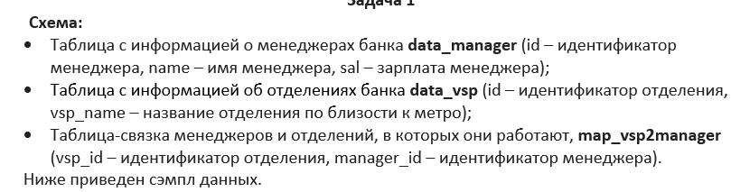
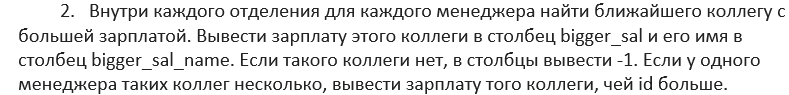
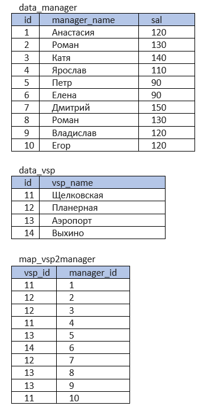

Тестовое задание на позицию Junior Data Analyst. Задача по SQL

Запросы SQL с решением (сделал двумя разными способами) хранятся в файлах <u>SQL_request_1.sql и SQL_request_2.sql</u>

В файле <u>solution_test_task_1.ipynb</u> хранится решение в питоне через эмулятор sql

Объяснение решения: Сначала я объединяю таблицы чтобы получить все соответсвия. Потом присваиваю менеджерам ранги с повторениями по зарплате внутри каждого отделения. Первому рангу задаю значение '-1', так как первый ранг не может иметь коллегу с более высокой зарплатой, а для остальных подбираю в пару коллегу с более высоким рангом и бОльшим id. Делаю это двумя разными способомами. 
Способ 1, через коррелирующий подзапрос: я использую дубль основной таблицы. Каждая строка с менеджером в главной таблице прогоняется через дублирующую и находит себе там нужного коллегу по указанным условиям. 
Способ 2, через self join: я к главной таблице мерджу эту же таблицу, но предарительно в правой таблице смещаю ранги на один шаг. Отфильтровываю пары не подходящие под условия, и таким образом остаются только нужные пары менеджеров.
