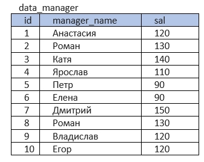
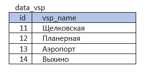
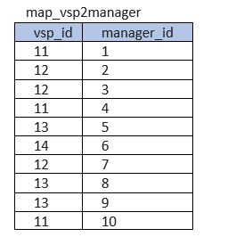

## Тестовое задание на позицию Junior Data Analyst. Задача по SQL

## Дано:

Таблица с информацией о менеджерах банка **data_manager**:
'id' - идентификатор менеджера,
'name' - имя менеджера,
'sal' - зарплата менеджера

Таблица с информацией об отделениях банка **data_vsp**:
'id' - идентификатор отделения,
'vsp_name' - название отделения по близости к метро

Таблица-связка менеджеров и отделений, в которых они работают, **map_vsp2manager**:
'vsp_id' - идентификатор отделения,
'manager_id' - идентификатор менеджера

 

## Задача:
Внутри каждого отделения для каждого менеджера найти ближайшего коллегу с бОльшей зарплатой. Вывести зарплату этого коллеги в столбец bigger_sal и его имя в столбец bigger_sal_name. Если такого коллеги нет, в столбцы вывести _1. Если у одного менеджера таких коллег несколько, вывести зарплату того коллеги, чей id больше.

## Файлы

* Запросы SQL с решением (сделал двумя разными способами) хранятся в файлах **SQL_request_1.sql** и **SQL_request_2.sql**

* В файле **solution_test_task_1.ipynb** хранится решение в питоне через эмулятор sql

## Решение

Сначала я объединяю таблицы чтобы получить все соответствия. Потом присваиваю менеджерам ранги (с повторениями для одинаковых значений) по зарплате внутри каждого отделения. Для первого ранга задаю значение bigger_sal '-1', так как первый ранг не может иметь коллегу с более высокой зарплатой, а для остальных подбираю в пару коллегу с более высоким рангом и бОльшим id. Делаю это двумя разными способомами.\
Способ 1, через коррелирующий подзапрос: я использую дубль основной таблицы. Каждая строка с менеджером в главной таблице прогоняется через дублирующую таблицу и находит себе там нужного коллегу по указанным условиям.\
Способ 2, через self join: я к главной таблице мерджу эту же таблицу, но предварительно в правой таблице смещаю ранги на один шаг вверх, и в пару ставлю более "рангового" коллегу. По условиям отфильтровываю лишние пары, и получаю нужный id менеджера в пару из правой таблицы.
